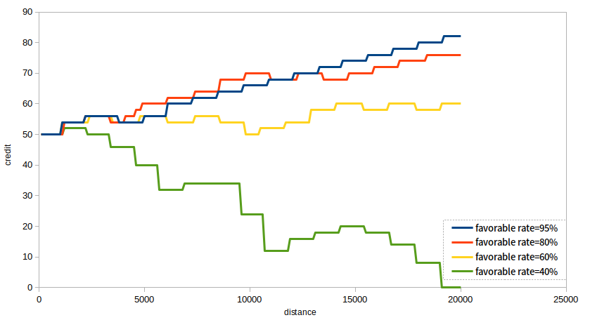

## 1. Position Verification
experimental environment:
- distance:0-100
- number of verification:20
- the parameters of script:  
    param|value
     :-:|:-:
  TOTAL|100
  TOTAL_ver|20
  TIME_res|2000
  TIME_ver|10000

success rate:80%,60%,40%,uniform distribution

## 2. Order
experimental environment:
- distance:0-20000
- number of evaluation:20
- 70% midium + 10% low+20% high
- the parameters of script:  
    param|value
     :-:|:-:
  TOTAL|20000
  TOTAL_eva|20
  TIME_res|100
  TIME_eva|2000

## 3. Evaluation
experimental environment:
- distance:0-20000
- number of evaluation:20
- order rate=100%
- the parameters of script:  
    param|value
     :-:|:-:
  TOTAL|20000
  TOTAL_eva|20
  TIME_res|100
  TIME_eva|2000

  

## 4. Together
experimental environment:
- distance:0-20000
- number of evaluation:20
- order rate=100%
- the parameters of script:  
    param|value
     :-:|:-:
  TOTAL|20000
  TOTAL_eva|20
   TOTAL_ver|200
  TIME_res|1000
  TIME_eva|1000000
    TIME_ver|100000

  